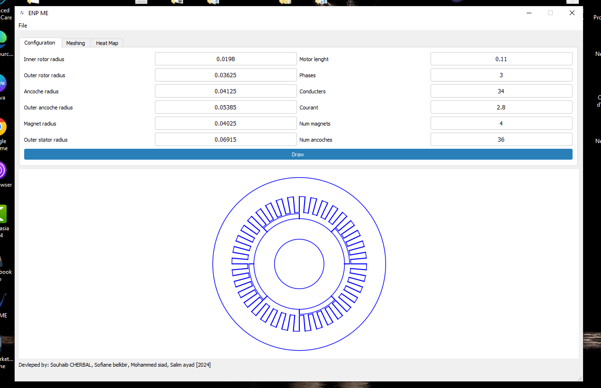
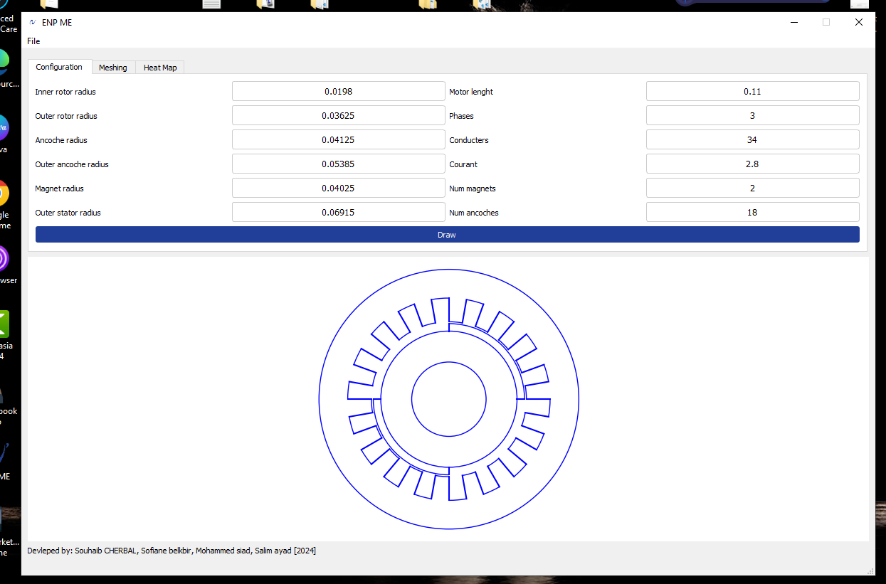

# ENP ME (Machines électrique) Software

### Developed by:
- Souhaib Cherbal
- Sofiane Belkbir
- Mohammed Siad
- Salim Ayad

**Year of Development**: 2024

## Overview

ENP ME (Réseau électrique) is a Python-based software designed to simulate and visualize key electrical parameters for electrical machines and networks. The software leverages the **Magnetic Reluctance Network Method (MRNM)** to compute magnetic induction, offering an innovative alternative to more traditional approaches like the Finite Element Method (FEM). This project aims to provide a user-friendly interface that helps engineers and researchers model, mesh, and analyze various electrical parameters such as flux and potential across different network configurations.

### Key Features:
1. **Configuration Panel:**
   - Set up various operational configurations for electrical machines and networks.
   
2. **Meshing Tool:**
   - Customize the degree of meshing and the meshing radius.
   - Visualize electrical machine geometry through a meshing process to prepare it for further analysis.

3. **Heat Map Visualization:**
   - Generate heat maps for flux and electrical potential based on the machine's configuration.
   - The results are displayed in a clear, color-coded diagram, allowing users to analyze variations in flux and potential.

4. **Matplotlib-Based Results Display:**
   - Uses Matplotlib to generate detailed heat maps, providing an intuitive and interactive way to explore the results of the analysis.
   - Multiple parameter visualizations like magnetic flux and potential values.

---

## Theory: Magnetic Reluctance Network Method (MRNM)

ENP ME is powered by the **Magnetic Reluctance Network Method (MRNM)**, an innovative approach to modeling magnetic induction in electrical machines. This method simplifies complex geometries into a network of magnetic reluctances, representing how easily magnetic flux flows through different parts of the machine.

### Why Use MRNM?

**MRNM** offers several key advantages over traditional methods:

- **Simplified Modeling**: Complex magnetic circuits, such as those found in motors and transformers, can be broken down into manageable components, making the analysis process far more intuitive.
  
- **Reduced Computation Time**: Unlike methods that require intense computational resources, MRNM allows for quicker results without the need for extensive meshing and iterative solvers.

- **Intuitive Insights**: By visualizing the flow of magnetic flux through the network, engineers can gain deeper insights into how magnetic paths behave under various conditions.

---

## Comparison: MRNM vs Finite Element Method (FEM)

While the **Finite Element Method (FEM)** is widely recognized for its high accuracy, it is often **computationally expensive** and requires detailed meshing of the machine’s geometry. MRNM, on the other hand, provides a more streamlined approach that is perfect for **early-stage design** and **analysis**. 

### Breakdown:

| Method      | FEM                                              | MRNM                                                 |
|-------------|--------------------------------------------------|------------------------------------------------------|
| **Accuracy** | Very high, but requires significant computational resources | Accurate enough for many real-world applications |
| **Computation** | Computationally intensive and time-consuming | Fast results with minimal computational effort |
| **Implementation** | Complex, requires detailed meshing and fine-tuning | Simple to implement, even for complex geometries |
| **Best Use** | Final validation and high-precision simulations | Early-stage design and rapid iteration |

### Validation Against FEM

The results obtained using **PolyMRNM** were validated against simulations performed in **FEMM** (Finite Element Method Magnetics) software. The comparison of the flux distribution results showed a strong correlation, confirming the accuracy of the MRNM approach for practical use in electrical machine design.

---

## Screenshots
**Configuration Interface:**


**Meshing Interface:**


**Flux Distribution Heat Map:**


**Potential Distribution Heat Map:**


---

## Installation

1. Clone this repository:

   ```bash
   git clone https://github.com/yourusername/enp-me.git
   cd enp-me
   ```

2. Install the required Python packages using pip:

   ```bash
   pip install -r requirements.txt
   ```

3. Run the application:

   ```bash
   python main.py
   ```

---

## Usage

1. **Configuration Tab:**
   - Set up the parameters of your electrical network.
   
2. **Meshing Tab:**
   - Adjust the meshing degree and radius to refine the network model.

3. **Heat Map Tab:**
   - Choose between flux or potential calculations and generate the heat map.

---

## Future Developments:

1. **Improved 3D Visualization**:
   - Add 3D meshing and 3D heat map visualizations to enhance the depth of analysis for electrical network models.
   
2. **Export Results**:
   - Allow the export of simulation results in multiple formats such as CSV, JSON, or images for easy sharing and further analysis.
   
3. **Multiple Calculation Models**:
   - Introduce various calculation algorithms to simulate not only flux and potential but also other electrical parameters like current density, electric field strength, etc.

4. **Real-Time Simulation**:
   - Implement real-time simulations where users can adjust parameters on the fly and immediately see updated results.

---

## License

This project is licensed under the MIT License - see the LICENSE file for details.

---

## Contributions

Contributions are welcome! Feel free to open issues or submit pull requests. For major changes, please open an issue first to discuss what you would like to change.

---
